# 💡 LED Pisca-Pisca com Arduino

Este repositório mostra o passo a passo de como montar e programar um LED para piscar usando o ESP32.

---

## 🔧 Passo a Passo

### 1️⃣ Placa usada.  
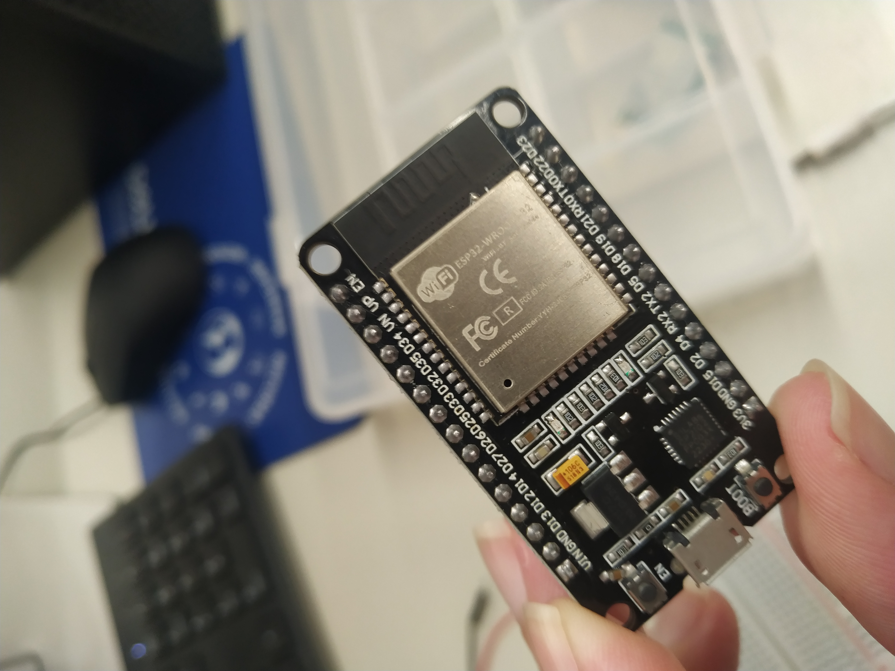

### 2️⃣ Protoboard usada
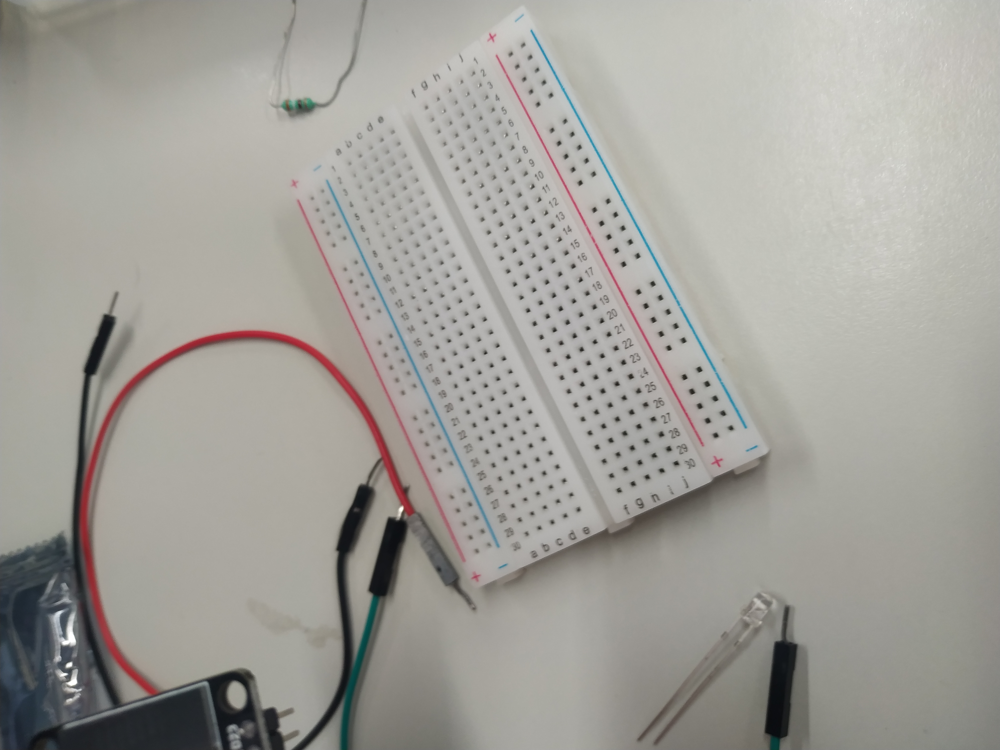

### 3️⃣ Conectando ESP32 na Protoboard
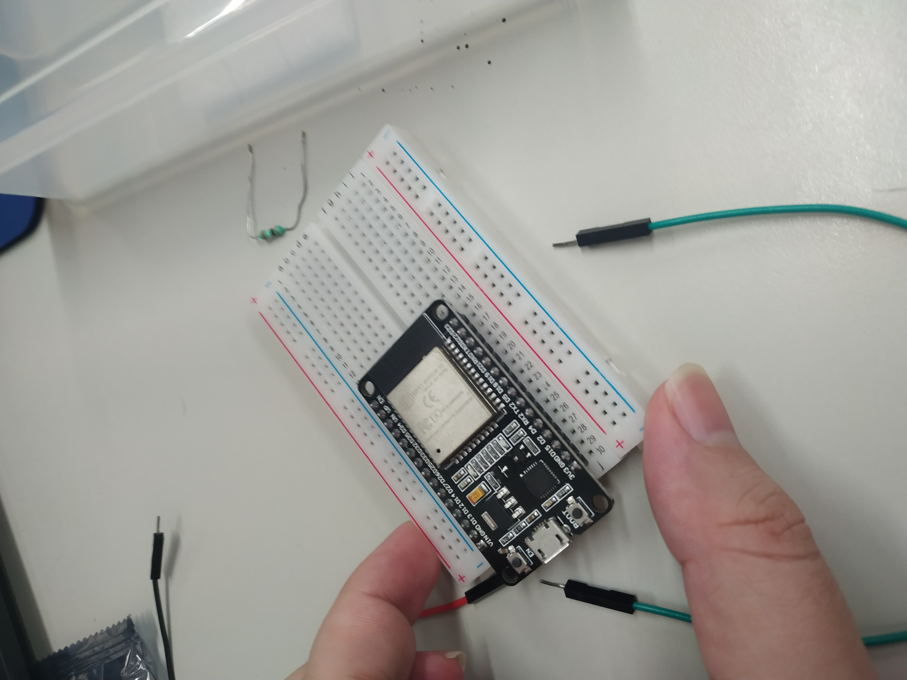

### 4️⃣ Ligando o fio no GND
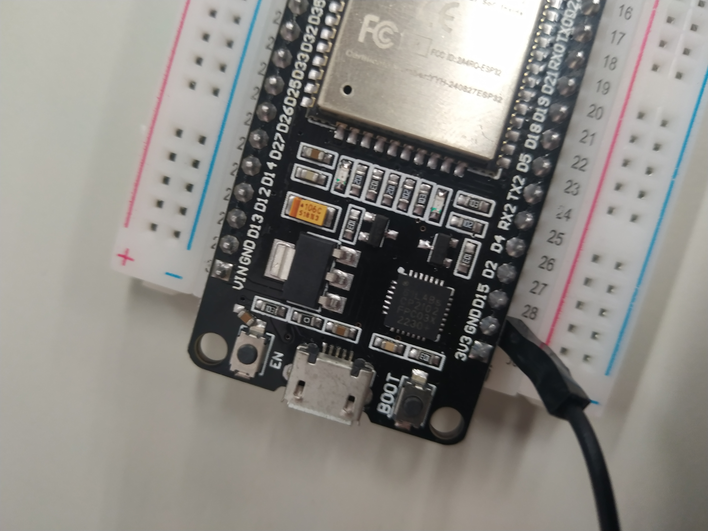

### 5️⃣ Ligando o fio no D18
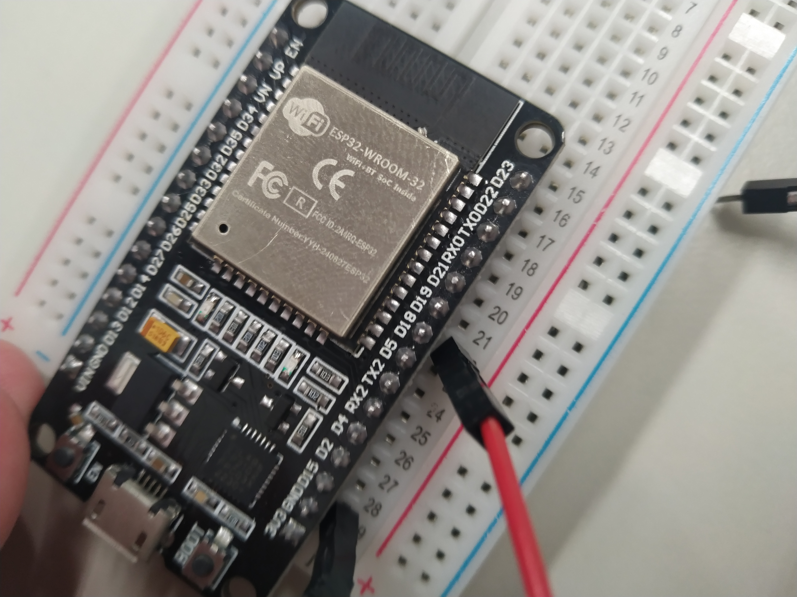

### 6️⃣ Resistor utilado (Importante para o led não queimar)
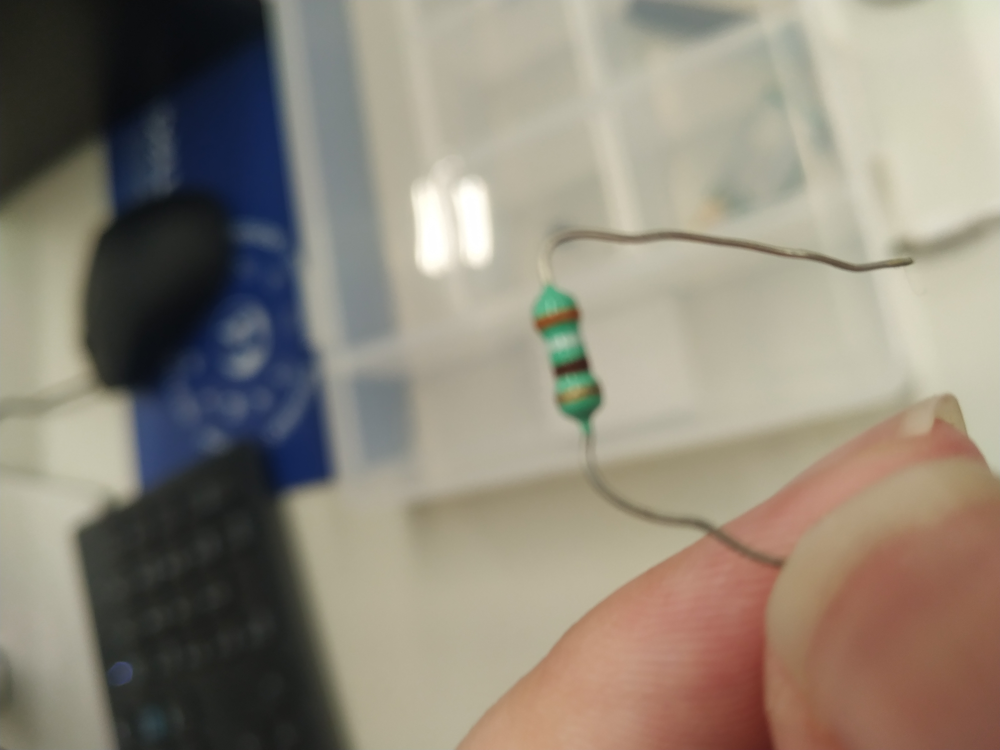

### 7️⃣ Onde conectar o Resistor
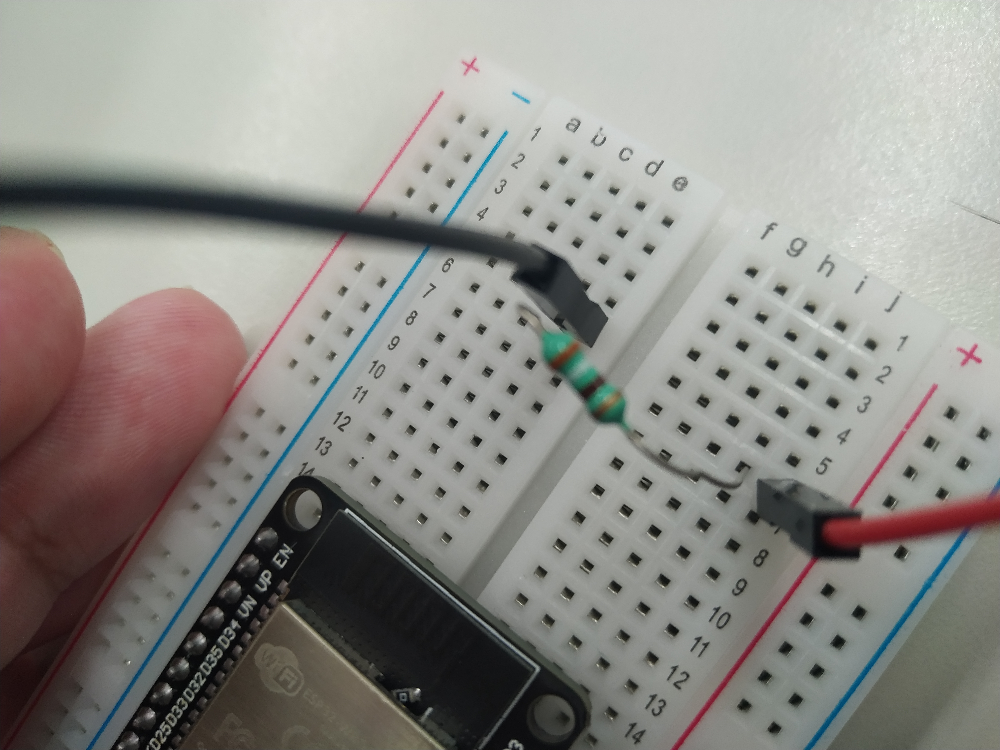

### 8️⃣ LED usado
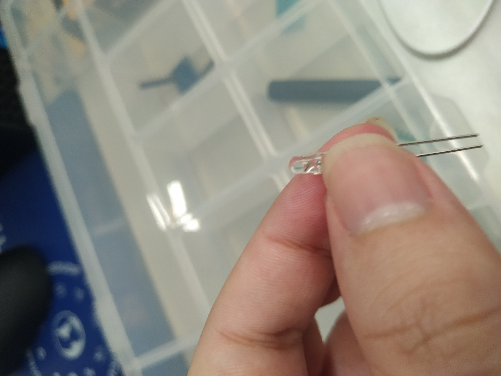

### 9️⃣ Onde e como colocar o LED (A parte maior ou curvada de metal é o positivo e a parte menor ou mais reta é o negativo)
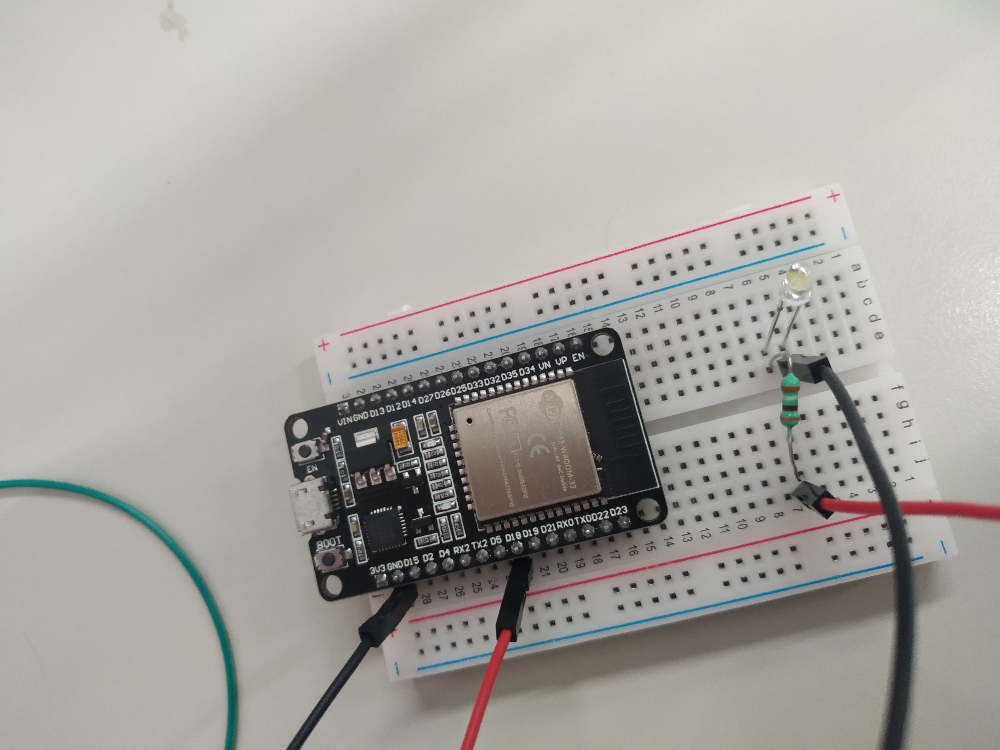

### 🔟 Conctando o cabo no ESP32
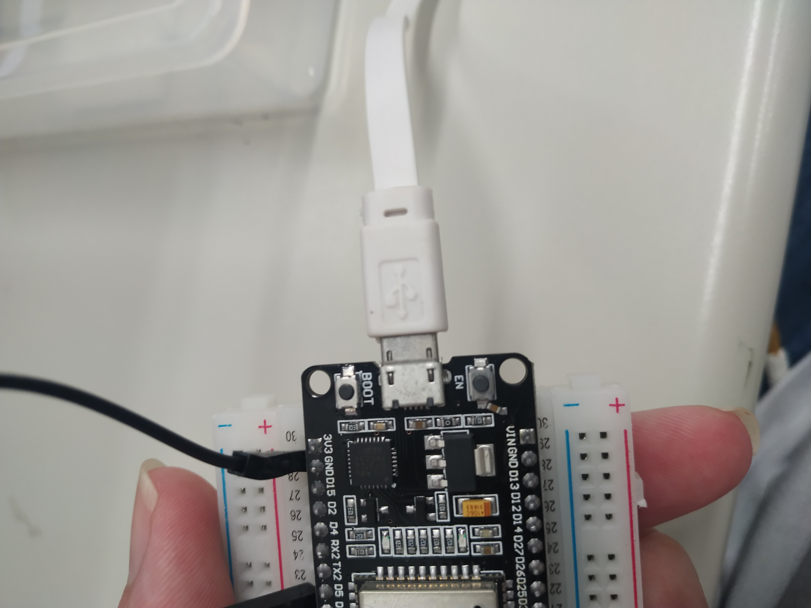

### 1️⃣1️⃣ Conctando o cabo no Computador
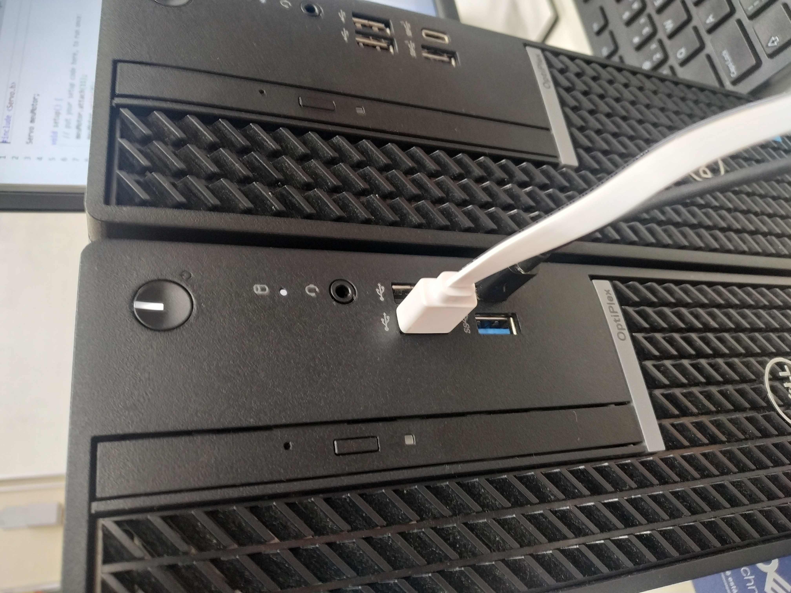

### 1️⃣2️⃣ Código a ser utilizado feito no arduino IDE  
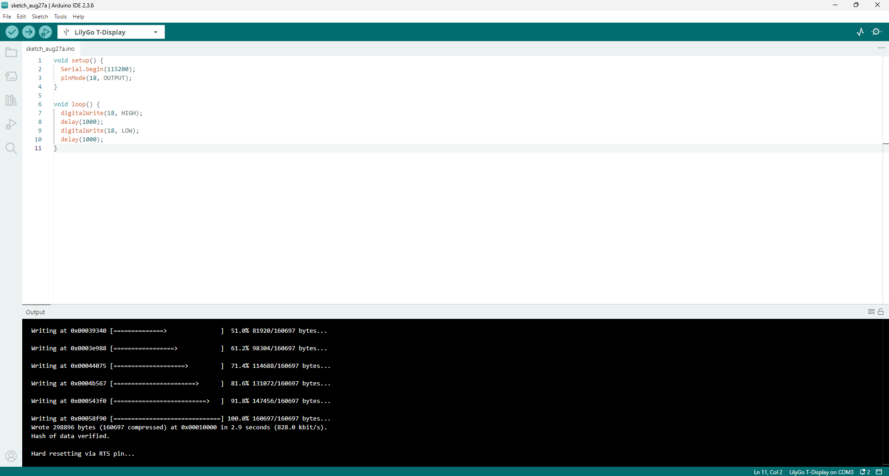

### 1️⃣3️⃣ Fazendo uploud do código para o ESP32  

### 1️⃣4️⃣ Resultado final do projeto 🚀  
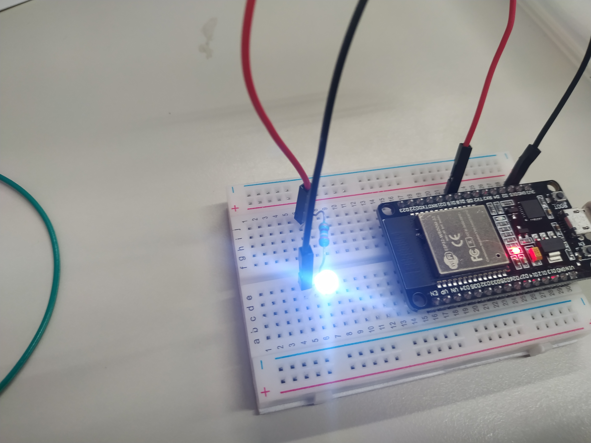
